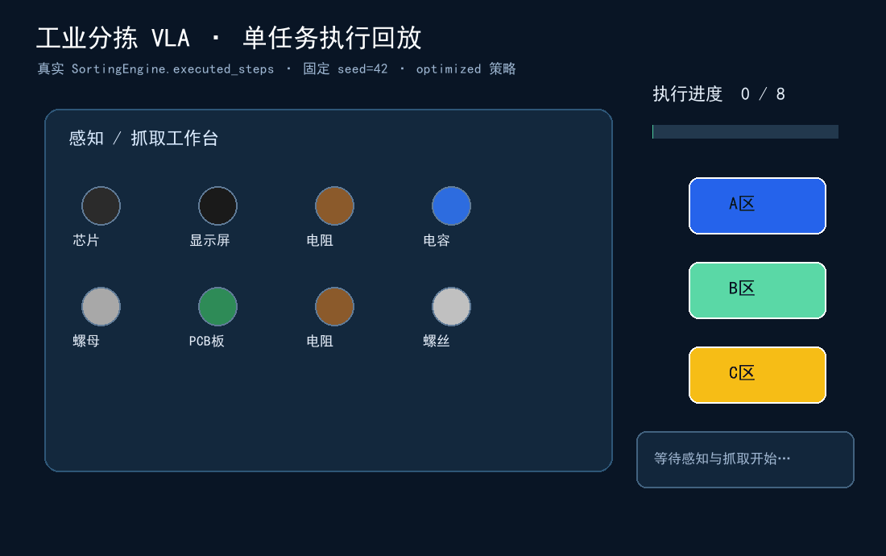

# 工业分拣 VLA 仿真 POC + 评测分析系统

> **一句话定位**：用 VLA（视觉-语言-动作模型）+ MuJoCo 仿真打通"看图 → 理解指令 → 规划 → 执行分拣"的技术闭环；再用一整套**分层评测体系 + 5 类失败分析 + 数据驱动的优化建议**，把它从"算法 Demo"升级为"可落地产品验证"。
>
> 面向 **Mac Studio / Apple Silicon（M 系列芯片）** 开发与演示。**只装核心轻量依赖即可跑通完整演示**——仿真自动用 Mock、VLA 自动用规则基线、看板自带 3 个版本的预置演示数据，开箱即丰富。

---

## ⚡ 30 秒快速上手（TL;DR）

只需 6 个核心依赖即可跑通全部演示——不装 MuJoCo / PyTorch / SmolVLA 也能看到完整看板：

```bash
cd "/Users/robin/Desktop/JS/t2 - 工业分拣VLA仿真POC"
pip install numpy pandas pyyaml streamlit plotly matplotlib   # 6 个核心依赖
streamlit run src/dashboard/app.py                            # 首次自动造 3 版演示数据
# 浏览器打开 http://localhost:8501 —— 总览 / 失败分析 / 版本对比 三页开箱即丰富
```

想看单任务控制台流水：`python -m src.sorting.engine`；想跑一次真实评测：`python -m src.evaluation.benchmark --seed 42`。
完整环境（含可选重依赖）见 [§4](#4-完整-mac--apple-silicon-环境搭建)；快速体验路径见 [§9](#9-快速体验路径3-分钟了解核心能力)。

> **关键词（Keywords）**：VLA（Vision-Language-Action）· 具身智能 / Embodied AI · 机器人分拣 / Robotic Sorting · MuJoCo 仿真 / Simulation · 世界模型 / World Model · Apple Silicon MPS · 评测体系 / Benchmark & Evaluation · 失败归因 / Failure Attribution · 数据驱动优化 / Data-driven Optimization · 产品思维 / Product Thinking · Python · Streamlit · Plotly · SQLite · PyTorch · SmolVLA。

### 单任务执行回放

下面的 GIF 基于 `SortingEngine.run_task(seed=42)` 的真实执行步骤生成，展示感知、抓取、成功/失败、重试与分拣进度。



---

## 目录

1. [项目定位与亮点](#1-项目定位与亮点)
2. [功能模块总览](#2-功能模块总览)
3. [技术栈](#3-技术栈)
4. [完整 Mac / Apple Silicon 环境搭建](#4-完整-mac--apple-silicon-环境搭建)
5. [一键脚本用法](#5-一键脚本用法)
6. [目录结构](#6-目录结构)
7. [三种运行方式](#7-三种运行方式)
8. [降级矩阵](#8-降级矩阵缺什么走哪条降级线)
9. [快速体验路径（3 分钟了解核心能力）](#9-快速体验路径3-分钟了解核心能力)
10. [常见问题 FAQ](#10-常见问题-faq)

---

## 1. 项目定位与亮点

工业 3C 产线上，零件（螺丝、电容、芯片、PCB 板……）需要按颜色 / 材质 / 类别 / 优先级被分拣到不同料盒。传统视觉分拣"换一种指令就要重写规则"，而 **VLA（Vision-Language-Action）** 模型可以直接"听懂自然语言指令 + 看懂场景 → 输出动作序列"。

本项目做了两件事，对应两种能力的"实锤"：

### 亮点一：VLA + 仿真的技术实锤（工程能力）

- **完整的感知→理解→规划→执行闭环**：相机取图 → VLA 解析指令并生成 `ActionPlan` → planner 路径/优先级排序 → 仿真逐步执行（带置信度阈值、重试、异常恢复）。
- **三档 VLA 后端、统一工厂、自动降级**：`rule_based`（纯规则基线，永远可用）→ `vlm_rule`（VLM + 规则，VLM 不可用回退规则）→ `smolvla`（SmolVLA-500M，torch + transformers + MPS，加载失败回退规则）。一个 `get_vla()` 工厂统一创建并兜底。
- **MuJoCo 仿真 + Mock 物理双轨**：有 MuJoCo 走真实物理引擎离屏渲染；没有就用纯 numpy 的 `MockPhysics` 运动学近似 + matplotlib 合成俯视图。**全流程无 MuJoCo 也能跑通**。
- **世界模型（World Model）选装**：抓取前做风险评估（易碎 + 大件 + 平板/玻璃 → 高掉落风险），可调整姿态或改顺序，用于 A/B 对比成功率提升。

### 亮点二：评测体系 + 失败分析的产品思维（产品能力）

> 这才是把"能跑"变成"能落地"的关键，也是本项目相对纯算法 Demo 的差异点。

- **分层指标体系**：北极星指标（任务成功率）→ 核心指标（效果）→ 过程指标（效率 / 稳定性）→ 辅助指标（成本），并行映射到"效果 / 效率 / 稳定性 / 成本"四组。每个指标都有口径、目标值、雷达权重。
- **5 大类失败分类法**：感知 / 理解 / 规划 / 执行 / 环境，每类含子类与统一配色，全项目一致。让"失败"从一个数字变成**可归因、可聚合、可下钻**的分析对象。
- **真实可分析的失败注入模型**：评测**无需真实机器人/真实 CV**——按 SPEC §7 用概率模型，依据难度与零件属性注入 5 类失败（遮挡↑感知失败、相似物↑识别错误、易碎大件↑放置失败、模糊指令↑理解失败、多零件↑规划失败、随机↑环境异常）。基线在简单/中等/困难成功率约 **0.85 / 0.70 / 0.55**，启用更优策略或世界模型整体 **+8~15 个百分点**。`benchmark` 支持 `seed` 复现。
- **数据驱动的优化建议**：失败分析 + 指标 → 自动生成 3~6 条"高影响低成本优先"的建议，带数据支撑与预期收益（如"感知失败占比 40%，建议多视角融合，预期成功率 +6~8pct"）。
- **开箱即丰富的看板**：Streamlit + Plotly，预置 3 个版本（v1 基线 → v2 优化策略 → v3 优化策略 + 世界模型）的历史评测数据（成功率约 **0.62 → 0.74 → 0.83**），首次启动自动 `seed_demo()`，无需先跑评测就能看到趋势 / 对比 / 失败下钻。

---

## 2. 功能模块总览

| 模块 | 路径 | 职责 |
|---|---|---|
| **仿真环境** | `src/simulation/` | `SortingEnv`（MuJoCo / Mock 双轨）、`SimpleArm` 机械臂、零件库 `PARTS`、相机俯视/侧视合成图 |
| **VLA 模型** | `src/vla/` | `BaseVLA` 抽象 + 三后端（rule_based / vlm_rule / smolvla）+ `get_vla()` 工厂兜底 |
| **分拣引擎** | `src/sorting/` | `SortingEngine.run_task()` 编排全流程；planner 路径/优先级；strategies 阈值/重试/恢复；**失败注入模型** |
| **评测体系** | `src/evaluation/` | `BenchmarkRunner` 跑 30 任务；metrics 分层指标；failure_analysis 聚合；recommendation 建议 |
| **世界模型** | `src/world_model/` | `assess_grasp_risk` 抓取风险评估、`simulate_rollout` 预测失败，用于 A/B |
| **存储** | `src/storage.py` | SQLite（`benchmark_runs` / `task_results` / `failure_cases`）+ JSON；`seed_demo()` 确定性造 3 版数据 |
| **看板** | `src/dashboard/` | Streamlit 三页：总览 / 失败分析 / 版本对比；`charts.py` 可复用 Plotly 构造器 |
| **工具** | `src/utils/` | `mps_utils`（设备探测）、`data_utils`（IO/配色）、`viz_utils`（合成场景图/时长格式化） |
| **配置** | `config/` | `env_config` / `model_config` / `tasks`（30 任务）/ `metrics`（指标定义） |
| **资源** | `assets/` | `scene.xml`、零件目录、3 档难度场景 |
| **产品文档** | `docs/` | 产品设计 / 指标体系 / 失败分析方法论 / 迭代计划 |

---

## 3. 技术栈

| 层 | 选型 | 说明 |
|---|---|---|
| 语言 | **Python 3.10+**（实测 3.14 亦可） | 纯 Python 编排，重负载组件全部可选 + 优雅降级 |
| 仿真 | **MuJoCo 3.1+**（可选） | Apple Silicon 友好；缺失自动回退 `MockPhysics`（纯 numpy） |
| VLA / 深度学习 | **PyTorch（MPS）+ transformers**（可选） | MPS 优先，缺失回退 CPU 或规则 VLA；**禁止 CUDA-only 包** |
| VLA 模型 | **SmolVLA-500M**（可选） | 支持 8bit/4bit 量化、HF 镜像；加载失败回退 `rule_based` |
| 看板 | **Streamlit + Plotly**（核心） | B 端数据看板风格，主蓝 `#2563EB`，适配 Retina |
| 数据 | **numpy / pandas / pyyaml**（核心） | 数据处理与配置 |
| 绘图 | **matplotlib**（核心） | 合成俯视场景图 |
| 计算机视觉 | **opencv-python-headless**（可选） | 缺失不影响演示 |
| 存储 | **SQLite（标准库 sqlite3）+ JSON** | DB 文件 `data/app.db` |

> **核心依赖只有 6 个**：`numpy pandas pyyaml streamlit plotly matplotlib`。它们都有 arm64 wheel，装上即可跑通**全部演示**。其余 `mujoco / torch / torchvision / transformers / opencv-python-headless` 全部可选，缺失自动降级。

---

## 4. 完整 Mac / Apple Silicon 环境搭建

> 适用机型：Mac Studio / MacBook（M1 / M2 / M3 / M4 等 Apple Silicon）。Intel Mac 亦可（无 MPS，自动走 CPU）。
> **最省心路线**：直接看 [4.1 Homebrew]→[4.2 Miniconda]→[4.3 Python 环境]→[4.7 安装核心依赖]→[一键脚本](#5-一键脚本用法) 即可全演示；MuJoCo / PyTorch / SmolVLA 都是"加强项"，按需再装。

### 4.1 安装 Homebrew（macOS 包管理器）

```bash
# 官方安装脚本
/bin/bash -c "$(curl -fsSL https://raw.githubusercontent.com/Homebrew/install/HEAD/install.sh)"

# Apple Silicon 上 Homebrew 装在 /opt/homebrew，需要把它加入 PATH（zsh 默认 shell）
echo 'eval "$(/opt/homebrew/bin/brew shellenv)"' >> ~/.zprofile
eval "$(/opt/homebrew/bin/brew shellenv)"

# 验证
brew --version
```

国内网络慢可考虑切换 Homebrew 镜像（清华 / 中科大），此处不展开。

### 4.2 安装 Miniconda（Apple Silicon 版）

**务必下载 arm64 / Apple Silicon 版**，不要装 x86_64 版（否则会跑在 Rosetta 转译下，性能差）。

```bash
# 方式 A：Homebrew Cask（最简单）
brew install --cask miniconda

# 方式 B：官方安装包（手动）—— 注意是 arm64 / MacOSX-arm64
curl -O https://repo.anaconda.com/miniconda/Miniconda3-latest-MacOSX-arm64.sh
bash Miniconda3-latest-MacOSX-arm64.sh

# 初始化 conda（zsh）
conda init zsh
# 重开终端或 source ~/.zshrc 使其生效

# 验证：platform 应为 osx-arm64
conda info
```

> 若不想用 conda，也可以用 Python 自带 `venv`（见下方）；本项目的 `setup.sh` 会自动检测：有 conda 用 conda，否则用 venv。

### 4.3 创建 Python 3.10 环境

```bash
# 用 conda（推荐）
conda create -n vla_sorting python=3.10 -y
conda activate vla_sorting

# 或者用 venv
python3.10 -m venv .venv
source .venv/bin/activate

# 验证：应输出 arm64
python -c "import platform; print(platform.machine())"   # 期望 arm64
python --version                                          # 期望 Python 3.10.x
```

### 4.4 安装并验证 MuJoCo（可选，缺失自动用 Mock 物理）

MuJoCo 3.x 对 Apple Silicon 原生支持，直接 pip 即可：

```bash
pip install mujoco

# 验证导入 + 版本
python -c "import mujoco; print('MuJoCo OK:', mujoco.__version__)"
```

**常见问题（Mac）**

- **GLFW / 开窗渲染失败**：`render(mode="human")` 需要 GLFW 弹窗，远程 / 无显示器 / 权限受限时可能失败。本项目对此**自动降级到离屏渲染或跳过**，绝不崩溃。如只做评测/看板，根本不需要开窗，用离屏渲染即可。
- **Retina 高分屏**：弹窗物理像素是逻辑像素的 2 倍，离屏渲染分辨率按需在 `env_config.yaml` 的相机参数里调整即可。看板内的合成场景图由 Plotly/matplotlib 绘制，天然适配 Retina。
- **中文字体缺失（matplotlib 合成图中文乱码 / 方框）**：matplotlib 默认无中文字体。本项目 `viz_utils` 已做字体兜底（优先 `PingFang SC` / `Heiti SC` / `Arial Unicode MS` 等 macOS 自带字体），若仍乱码可在系统装思源黑体或在 `viz_utils` 指定字体路径。
- **`mjpython` 与交互查看器**：MuJoCo 自带的 `viewer` 在 macOS 上需用 `mjpython` 启动；本项目演示路径**不依赖**交互查看器，无需关心。
- **导入即段错误 / 找不到库**：基本是装了 x86_64 版 Python/MuJoCo 跑在 Rosetta 下。请确认 `platform.machine()` 为 `arm64`，用 arm64 conda 重建环境。

> **没装 MuJoCo 也完全没问题**：`SortingEnv.backend` 会变成 `"mock"`，用纯运动学 + matplotlib 合成俯视图，评测/看板照常运行。

### 4.5 安装并验证 PyTorch（MPS，可选）

PyTorch 官方 wheel 原生支持 Apple Silicon 的 **MPS（Metal Performance Shaders）** 后端：

```bash
# CPU/MPS 版（不要装任何 CUDA 版！Mac 没有 NVIDIA GPU）
pip install torch torchvision

# 验证 MPS 是否可用
python -c "import torch; print('torch', torch.__version__, 'MPS available:', torch.backends.mps.is_available())"
```

- **MPS 可用** → 本项目 `mps_utils.get_device()` 返回 `'mps'`，SmolVLA 推理走 GPU。
- **MPS 不可用**（旧系统 / Intel Mac）→ 自动返回 `'cpu'`，照常运行只是慢一些。
- **torch 完全没装** → `get_device()` 仍返回 `'cpu'` 字符串且**不报错**；VLA 自动回退 `rule_based`。

### 4.6 安装 VLA 模型 SmolVLA-500M（可选，最"加强"的一项）

SmolVLA-500M 是轻量 VLA 模型，配合量化可在 Apple Silicon 上跑。**装不动 / 跑不动会自动降级到规则版**，演示不受影响。

```bash
pip install transformers accelerate
# 量化（可选，降显存/内存占用）
pip install bitsandbytes        # 8bit/4bit 量化（注意 Apple Silicon 上 bitsandbytes 支持有限，失败则用 fp16/CPU）
```

**HF 国内加速（镜像）**：国内下载 Hugging Face 模型慢，用 `hf-mirror.com` 镜像：

```bash
# 临时（当前终端）
export HF_ENDPOINT=https://hf-mirror.com
# 或写进 model_config.yaml（本项目已留镜像配置项）
```

- 模型 id、量化档位（`8bit` / `4bit`）、HF 镜像、device（`auto` / `mps` / `cpu`）均在 `config/model_config.yaml` 配置。
- `smolvla.py` 用**类级缓存**避免重复加载；`import` / 加载 / 推理任一失败 → 记录中文原因并回退 `rule_based`。
- **Apple Silicon 上量化注意**：`bitsandbytes` 的 CUDA 量化在 Mac 上不可用，本项目把量化当"尽力而为"，失败即用 fp16 或回退规则，不阻断流程。

### 4.7 安装其他依赖 / requirements

`requirements.txt` 分两段：

```text
# ===== 核心，必装（arm64 wheel，装上即可全演示）=====
numpy
pandas
pyyaml
streamlit
plotly
matplotlib

# ===== 可选，加强（缺失自动降级，不报错）=====
# mujoco                      # 仿真物理；缺失→MockPhysics
# torch                       # 深度学习；缺失→CPU/规则 VLA
# torchvision
# transformers                # SmolVLA；缺失→rule_based
# opencv-python-headless      # CV 增强；缺失不影响演示
```

```bash
# 只装核心（推荐先这样，确保能全演示）
pip install numpy pandas pyyaml streamlit plotly matplotlib
# 或
pip install -r requirements.txt
```

> **重要声明**：本项目**禁止 CUDA-only 包**，所有依赖兼容 arm64。请勿安装任何 `+cu1xx` / CUDA 专用 wheel——Mac 没有 NVIDIA GPU。

---

## 5. 一键脚本用法

项目根目录提供三个脚本（中文输出、容错降级）：

```bash
# 进入项目根目录（路径含空格与中文，整体加引号）
cd "/Users/robin/Desktop/JS/t2 - 工业分拣VLA仿真POC"

# 赋予执行权限（首次）
chmod +x setup.sh run_demo.sh run_benchmark.sh

# 1) 一键搭环境：检测 Homebrew/Miniconda → 建 python3.10 环境 → 装核心依赖 → 尝试装可选依赖（失败仅告警）→ 验证 MuJoCo/MPS
./setup.sh

# 2) 一键起看板（首次自动 seed_demo 造 3 版演示数据）
./run_demo.sh

# 3) 一键跑评测（默认 rule_based 跑 30 任务，打印中文摘要）
./run_benchmark.sh
```

- `setup.sh`：`set -e`，先装核心依赖，再**尝试**装可选依赖（失败只告警不中断），并做 `import mujoco` / MPS 验证，结尾提示后续脚本。
- `run_demo.sh`：激活环境后 `streamlit run src/dashboard/app.py`，提示访问 http://localhost:8501 。
- `run_benchmark.sh`：激活环境后 `python -m src.evaluation.benchmark --version v_new --vla rule_based`，跑完打印摘要并提示去看板查看。

---

## 6. 目录结构

```
t2 - 工业分拣VLA仿真POC/
├── README.md                      # 本文件
├── requirements.txt               # 核心 + 可选依赖（分段注释）
├── setup.sh                       # 一键搭环境（容错）
├── run_demo.sh                    # 一键起看板
├── run_benchmark.sh               # 一键跑评测
│
├── config/                        # 配置（YAML，含中文注释）
│   ├── env_config.yaml            # 场景布局/难度/物理/渲染/相机
│   ├── model_config.yaml          # VLA 后端/SmolVLA/量化/HF 镜像/device/阈值
│   ├── tasks.yaml                 # 30 个评测任务（5 类 × 6）
│   └── metrics.yaml               # 分层指标定义（key/name/layer/group/target/权重）
│
├── src/
│   ├── __init__.py
│   ├── storage.py                 # SQLite + JSON；init_db/save_run/seed_demo...
│   │
│   ├── simulation/                # 仿真
│   │   ├── env.py                 # SortingEnv（mujoco/mock 双轨）+ MockPhysics
│   │   ├── robot.py               # SimpleArm（UR5e + 二指夹爪，简化）
│   │   ├── objects.py             # PARTS 权威目录 + generate_scene
│   │   └── camera.py              # 俯视/侧视合成图（不强依赖 opencv）
│   │
│   ├── vla/                       # VLA 模型
│   │   ├── base.py                # BaseVLA 抽象 + action/ActionPlan 约定
│   │   ├── rule_based.py          # RuleBasedVLA（默认，永远可用）
│   │   ├── vlm_rule.py            # VLMRuleVLA（VLM+规则，失败回退）
│   │   ├── smolvla.py             # SmolVLAModel（torch+transformers+MPS，失败回退）
│   │   └── __init__.py            # get_vla() 工厂（统一兜底降级）
│   │
│   ├── sorting/                   # 分拣引擎（评测真实感核心）
│   │   ├── engine.py              # SortingEngine.run_task + 失败注入模型
│   │   ├── planner.py             # plan_order（最近邻路径 + 优先级）
│   │   └── strategies.py          # 置信度阈值/重试/异常恢复（命名版本）
│   │
│   ├── evaluation/                # 评测体系
│   │   ├── metrics.py             # compute_metrics + 分组指标
│   │   ├── failure_analysis.py    # analyze（5 类聚合 + Top10 + 案例）
│   │   ├── benchmark.py           # BenchmarkRunner（argparse 入口）
│   │   └── recommendation.py      # generate（高影响低成本优先建议）
│   │
│   ├── world_model/               # 世界模型（可选高级）
│   │   ├── base.py                # BaseWorldModel 抽象
│   │   └── simple_predictor.py    # SimpleGraspPredictor（启发式风险评估）
│   │
│   ├── dashboard/                 # Streamlit 看板
│   │   ├── app.py                 # 入口（侧边栏导航 + 首次 seed_demo）
│   │   ├── charts.py              # 可复用 Plotly 构造器（统一配色）
│   │   └── pages/
│   │       ├── overview.py        # 总览（核心卡片/难度/类型/趋势）
│   │       ├── failure.py         # 失败分析（饼/Top10/趋势/案例下钻）
│   │       └── comparison.py      # 版本对比（雷达/delta/优化建议）
│   │
│   └── utils/
│       ├── mps_utils.py           # get_device/device_info（安全 import）
│       ├── data_utils.py          # JSON/YAML IO、ndarray↔list、配色映射
│       └── viz_utils.py           # 合成俯视场景图、时长/百分比格式化
│
├── assets/
│   ├── models/scene.xml           # MuJoCo 场景
│   ├── objects/parts_catalog.json # 10 零件镜像目录
│   └── scenes/                    # scene_simple/medium/hard.json
│
├── data/
│   ├── demo_data.json             # 3 版本种子配置 + 零件目录
│   ├── app.db                     # SQLite（运行后生成）
│   ├── benchmark_results/         # 评测结果
│   └── failure_cases/             # 失败案例（含合成图 PNG）
│
└── docs/                          # 产品文档（体现 PM 深度）
    ├── product_design.md          # 产品定位/用户/场景/版本规划
    ├── metrics_system.md          # 指标体系详解
    ├── failure_analysis.md        # 失败分类方法论
    └── iteration_plan.md          # 迭代路线图
```

> **导入约定**：统一用以 `src` 为根的**绝对导入**（如 `from src.simulation.env import SortingEnv`、`from src.vla import get_vla`）。所有运行入口都**从项目根目录**执行。每个包目录都有 `__init__.py`。

---

## 7. 三种运行方式

> 全部从**项目根目录**运行；路径含空格与中文，`cd` 时整体加引号。

```bash
cd "/Users/robin/Desktop/JS/t2 - 工业分拣VLA仿真POC"
```

### 方式一：单任务仿真演示（看控制台流水）

```bash
python -m src.sorting.engine
```

`__main__` 跑一个示例分拣任务，控制台打印完整流水：场景生成 → 取相机图 → VLA `predict` → planner 排序 → 逐 action 执行（含重试/恢复）→ 结果汇总。用于快速验证"感知→理解→规划→执行"链路是否通。

### 方式二：批量评测（30 任务 + 失败分析）

```bash
# 默认
python -m src.evaluation.benchmark

# 带参数（版本号 / VLA 后端 / 策略 / 世界模型 / 随机种子复现）
python -m src.evaluation.benchmark --version v3 --vla rule_based --strategy optimized --world-model on --seed 42
```

加载 `config/tasks.yaml` 的 30 个任务逐个跑，汇总分层指标，聚合 5 类失败，写入 `data/app.db` 与失败案例，跑完打印中文摘要（成功率 / 准确率 / 平均耗时 / 失败分布）。`--seed` 保证结果可复现。

### 方式三：可视化看板（推荐演示用）

```bash
streamlit run src/dashboard/app.py
```

浏览器打开 http://localhost:8501 。**首次启动自动 `seed_demo()`** 造 3 个版本的历史评测数据，开箱即有：

- **总览页**：核心指标卡片（成功率/准确率/平均耗时/吞吐）、按难度/指令类型表现对比、历史趋势折线。
- **失败分析页**：5 类失败分布饼图（统一配色）、Top10 子类排行、各类失败趋势、点击下钻到失败案例（含由 `scene_json` 现场绘制的合成俯视场景图）。
- **版本对比页**：多版本雷达图、v1→v2→v3 各指标 delta、自动生成的优化建议（带优先级标签与预期收益）。

> 看板顶部显示当前 **VLA 后端 / 是否 Mock 仿真**徽标，让"现在跑在哪条降级线上"一目了然。

---

## 8. 降级矩阵（缺什么走哪条降级线）

> 设计第一原则：**容错降级**。`mujoco / torch / transformers / opencv` 全部是可选依赖，用 `try/except` 守卫导入，缺失自动降级，**绝不因缺包而崩溃**。

| 能力维度 | 理想（全装） | 缺失的依赖 | 自动降级到 | 对演示的影响 |
|---|---|---|---|---|
| **仿真物理** | MuJoCo 3.x 真实物理 + 离屏渲染 | `mujoco` 缺失或 `scene.xml` 加载失败 | `MockPhysics`（纯 numpy 运动学）+ matplotlib 合成俯视图，`backend="mock"` | 无影响，评测/看板照常 |
| **VLA 推理** | SmolVLA-500M（MPS 加速） | `transformers`/`torch` 缺失，或模型加载/推理失败 | `vlm_rule` → 最终 `rule_based`（纯规则，永远可用） | 无影响，规则基线就能跑完整评测 |
| **VLM 增强** | VLM（OpenAI/Qwen-VL）+ 规则 | 无 API key 或 httpx 调用失败 | `RuleBasedVLA`（纯规则） | 无影响 |
| **计算设备** | MPS（Apple GPU） | `torch` 缺失或 MPS 不可用 | `'cpu'` 字符串（`get_device()` 不报错） | 推理变慢或直接走规则 |
| **量化** | 8bit / 4bit（省内存） | `bitsandbytes` 在 Mac 不可用 | fp16 / CPU / 回退规则 | 无影响 |
| **窗口渲染** | GLFW 弹窗（`render("human")`） | 无显示器/权限/GLFW 失败 | 离屏渲染或跳过 | 无影响，演示不靠弹窗 |
| **CV 增强** | opencv 图像处理 | `opencv-python-headless` 缺失 | matplotlib / numpy 替代 | 无影响 |
| **合成图字体** | macOS 中文字体 | 字体缺失 | `viz_utils` 字体兜底链 | 极端情况下中文可能退化，不崩溃 |

**一句话**：只装 `numpy pandas pyyaml streamlit plotly matplotlib` 这 6 个核心依赖，就能跑通 **demo + benchmark + dashboard 全部演示**——仿真走 Mock、VLA 走规则、看板有预置数据。其余都是锦上添花，**装不上 / 跑不动会自动降到规则版**。

---

## 9. 快速体验路径（3 分钟了解核心能力）

> 目标：3 分钟内同时秀出"技术实锤"和"产品思维"。建议提前 `./run_demo.sh` 把看板起好。

**0:00–0:30 · 一句话定位 + 起看板**
> "这是工业 3C 分拣的 VLA 仿真 POC。它不只是让机器人能分拣，而是用一整套评测体系回答——**这套方案到底好不好、差在哪、下一步优化什么**。"
> 打开 http://localhost:8501，指顶部徽标说明"当前跑在 Mock 仿真 + 规则 VLA 这条最轻量的降级线上，没装任何重依赖也能全演示"。

**0:30–1:15 · 技术闭环（总览页）**
> 切到总览页，**先指顶部的横向闭环流程条**（指令→感知→理解→规划→执行→评测→失败归因→优化建议→回到指令）："这是系统的地图，一条链路端到端打通，最后一环回流形成迭代闭环。"
> 再指核心指标卡片与历史趋势："VLA 把自然语言指令 + 场景图，转成动作序列在仿真里执行。三个版本 v1→v2→v3，成功率从 0.62 涨到 0.83。换指令不用改规则，这是 VLA 相对传统视觉分拣的价值。"
> 可现场 `python -m src.sorting.engine` 跑一条，展示"感知→理解→规划→执行"控制台流水。

**1:15–2:15 · 产品思维（失败分析页）—— 重点**
> 切到失败分析页："关键不是成功率本身，而是失败的 0.17 都败在哪。我把失败分成感知/理解/规划/执行/环境 5 大类。"指饼图与 Top10："这版感知类失败占比最高，其中'遮挡看不见'是大头。"
> 点一个失败案例下钻，展示指令 + 难度 + 模型输出 + 现场绘制的场景图："每个失败都能归因、能复现、能看到当时的场景。"

**2:15–3:00 · 数据驱动迭代（版本对比页）**
> 切到版本对比页，指雷达图与 v1→v2→v3 的 delta："优化不是拍脑袋。"指自动生成的优化建议："系统根据失败分布给出建议——比如'感知失败占 40%，建议多视角融合，预期 +6~8pct'，带数据支撑、按高影响低成本排序。这就是从'技术 Demo'到'可迭代产品'的闭环。"

**收尾一句**
> "整套系统 Apple Silicon 友好、无 CUDA，只装 6 个核心包就能全演示；要上更强的 SmolVLA 模型，换个配置就行，跑不动会自动降级，绝不崩。"

---

## 10. 常见问题 FAQ

**Q1：我什么依赖都不想装多，能跑演示吗？**
能。只装核心 6 个（`numpy pandas pyyaml streamlit plotly matplotlib`），`./run_demo.sh` 即可看到完整看板（含 3 版预置数据）。仿真自动 Mock、VLA 自动规则。

**Q2：没装 MuJoCo 会怎样？**
`SortingEnv.backend` 变成 `"mock"`，用纯 numpy 运动学 + matplotlib 合成俯视图，评测/看板照常。看板顶部徽标会显示"Mock 仿真"。

**Q3：SmolVLA 模型跑不动 / 下载失败怎么办？**
自动回退到 `rule_based` 规则版，并在日志里打印中文原因。演示完全不受影响。下载慢可设 `export HF_ENDPOINT=https://hf-mirror.com` 或在 `model_config.yaml` 配镜像。

**Q4：Mac 上能用 CUDA / GPU 吗？**
Mac 没有 NVIDIA GPU，**禁止任何 CUDA-only 包**。本项目用 Apple 的 **MPS** 后端（`torch` 自动探测），MPS 不可用就走 CPU，torch 没装就走规则——三级降级。

**Q5：评测没有真实机器人/真实摄像头，结果可信吗？**
评测用 SPEC §7 的**概率失败注入模型**：依据难度与零件属性注入 5 类失败（遮挡↑感知、相似物↑识别、易碎大件↑放置、模糊指令↑理解、多零件↑规划、随机↑环境）。它的目的不是替代真机测试，而是让**评测体系与失败分析方法论本身可演示、可分析、可复现**（`--seed` 固定）。接入真实 VLA/仿真后，同一套指标与失败分类法即可直接复用。

**Q6：matplotlib 合成图里中文是方框 / 乱码？**
`viz_utils` 已做字体兜底（优先 macOS 自带 `PingFang SC` 等）。若仍乱码，安装思源黑体或在 `viz_utils` 指定字体路径。

**Q7：`render("human")` 开窗失败 / 黑屏？**
GLFW 弹窗在无显示器/权限受限时会失败，本项目**自动降级到离屏渲染或跳过**，不崩溃。演示路径（评测/看板）不依赖弹窗。

**Q8：导入报错 / 段错误？**
多半是 x86_64 Python 跑在 Rosetta 下。执行 `python -c "import platform; print(platform.machine())"` 确认输出 `arm64`；否则用 arm64 版 Miniconda 重建 `python=3.10` 环境。

**Q9：运行入口为什么是 `python -m src.xxx`？**
项目用以 `src` 为根的绝对导入，必须从**项目根目录**以模块方式运行才能正确解析包。`streamlit run src/dashboard/app.py` 因不以包方式加载，已在文件顶部用 `__file__` 计算项目根并插入 `sys.path`，可直接运行。

**Q10：端口被占用？**
Streamlit 默认 8501。被占用时用 `streamlit run src/dashboard/app.py --server.port 8502`。

---

> **设计哲学**：技术上能跑只是起点；用**分层指标 + 失败归因 + 数据驱动建议**回答"好不好、为什么、下一步"，才是把 POC 推向可落地产品的关键。**Apple Silicon 友好，无 CUDA，只装核心依赖即可全演示，重组件跑不动自动降规则版——绝不崩。**
